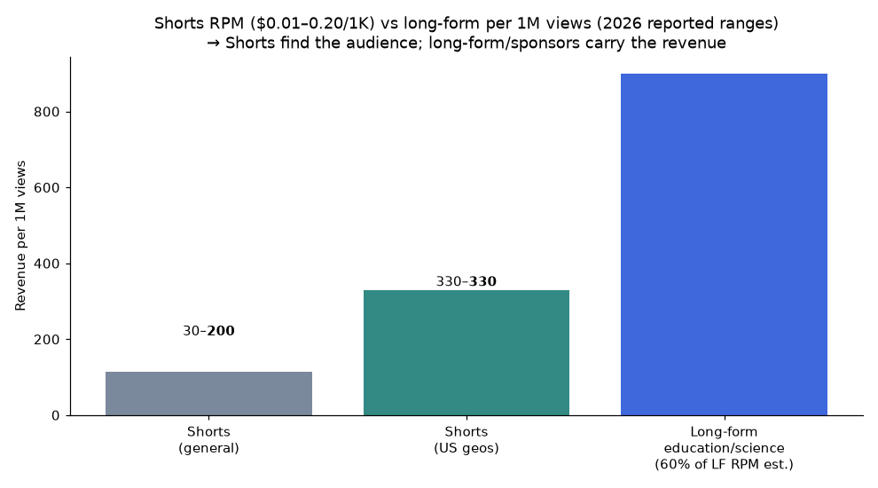
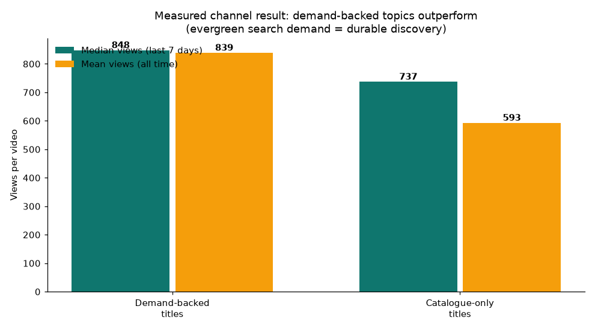

# Niche Future-Proofing Assessment: Mr-Nextep (US) & Neuro-Somaa (FR)

**Question:** Kya dono repos ke niches upcoming years (2026–2028+) mein value-for-money rahenge?
**Answer (short):** **Haan — dono niches structurally durable hain**, lekin monetization ka pura wazan abhi Shorts RPM par hai, aur Shorts ka pay rate future mein bhi low rahay ga. Asli "value for money" tab unlock hoga jab Shorts discovery ko long-form aur sponsorships mein convert kiya jaye. Report niches ki evergreen strength, 2026 algorithm shifts, AI-policy risk, aur channel-level measured data ko combine kar ke risk/return batati hai.

*Author: Manus AI · Date: August 15, 2026*

---

## 1. Verdict at a Glance

| Dimension | Mr-Nextep (US — body science / dark mystery) | Neuro-Somaa (FR — dark-mystery body science) |
|---|---|---|
| Evergreen demand | **Strong.** Human body does not change; "why does my body do X" queries persist every year | **Strong + less competition.** Same evergreen demand, French-language supply is far thinner |
| Demand trend to 2028 | "Science explained humorously" niche: RPM $5.32, **16x growth**, faceless-friendly [3] | Adjacent categories (sleep/wellness RPM $10.92; senior health/longevity 19x growth) show the same audience wave rising [3] |
| Monetization class | Mid-CPM education/science (~$8–11 CPM) — sustainable, not premium | Same class, but FR ad market CPMs slightly lower than US |
| Algorithm fit (2026) | Excellent: audience-matching rewards per-video specificity; demand-mined titles fit perfectly [4] | Same; French curiosity content rides the same algorithm with fewer competitors |
| Policy risk (AI content) | Managed: inauthentic-content policy targets *templated slop*; our signature-visual pipeline is the designed defense [5] | Same |
| Value-for-money verdict | **Yes — 8.5/10** | **Yes — 8/10** |

The creator economy context supports staying the course: market size is projected to grow from ~$252B (2025) to **$480B by 2027** and roughly **$1.35T by 2033** (CAGR 23.3%) [6] [7]. A channel planted in a durable education niche during that growth window compounds with the market.

---

## 2. Why These Niches Are Structurally Durable

**Evergreen subject matter.** "Why does my knee crack?", "Why does my stomach clench when I'm scared?" — no trend calendar governs these. Health and body-curiosity demand does not expire the way pop-culture or tech-review content does. vidIQ's 2026 niche framework explicitly lists *content longevity (evergreen vs. trending)* as the decisive evaluation axis, and education is among the categories it identifies as persistent across years [2]. Industry practitioners describe curiosity explainers the same way:

> "The demand is infinite. Every ordinary thing on earth hides a 'why.' This niche thrives on evergreen science." — creator community commentary, July 2026 [8]

**Demand is measurable and renewable.** Our own pipeline's live autocomplete mining (the demand-refresh system pushed earlier this week) continuously re-harvests real French and English search queries. When demand is *mined* rather than *guessed*, the niche refreshes itself: as long as humans remain curious about their bodies — and they demonstrably are — the topic pipeline cannot run dry.

**2026 algorithm shifts favor exactly this content shape.** Three changes matter most. First, YouTube moved from *channel growth* to *audience matching*: every video earns its own reach regardless of subscriber count, which is the single biggest tailwind a small channel can get [4]. Second, *specificity wins* — "Pourquoi les genoux qui craquent ?" (a precise, personally relevant question) beats broad titles, which is precisely the sentence structure our demand miner produces. Third, viewer *satisfaction signals* now weigh as much as CTR and retention, punishing clickbait and rewarding delivery — the sendable-ending fix (Gap 4) was built for exactly this [4].

**Non-English is not a weakness — it is a runway.** Over 60% of watch time on English channels comes from non-native speakers [9], and YouTube's own data shows non-English languages rising fastest as internet penetration grows in LatAm, India, and Africa [10]. A French channel therefore competes in a smaller pool with an audience that YouTube's localization machinery actively expands. Mr-Nextep's US channel simultaneously reaches the world's largest ad market.

---

## 3. The Honest Caveat: Monetization Is a Formats Game, Not a Niche Game

The data is unambiguous: **Shorts are a discovery engine, not a revenue engine.** Reported 2026 Shorts RPM runs roughly $0.01–0.07 per 1,000 views (occasionally up to $0.20), meaning 1M Shorts views ≈ $30–200, and US Shorts ≈ $0.33 per 1,000 views. Across 274 channels and 13 niches, Shorts RPM measures just 3–14% of long-form RPM [11]. For Shorts, niche matters less than country mix, engaged-view quality, and ad seasonality [11].

The measured channel result (Neuro-Somaa) confirms the demand mechanic works on discovery:

Demand-backed titles showed +15% median views in the last 7 days and a 4.5x higher probability of crossing the 1,000-view amplification threshold — the same mechanism industry sources call the demand-multiplier effect [1]. The niche finds the audience; the *format stack* determines what that audience is worth. Creators who pair Shorts with long-form earn 40–60% more than single-format creators [12].

---

## 4. Risk Register and Our Defenses

| Risk (2026–2028) | Severity | Our existing defense | Remaining gap |
|---|---|---|---|
| AI-faceless saturation + "inauthentic content" demonetization wave | High | Signature visual worlds (Le Labo Obscur / Neon Cortex), perceptual hash ledger (no reused visuals), original synthesized music, humanizer variation, cadence self-gating | None structural — but keep a proof-of-process trail (script drafts, project files) per policy advice [5] |
| Synthetics-disclosure regime tightening | Medium | Our signature AI renders are non-photorealistic/stylized (exempt from altered-content labeling); no deepfakes or real-person likeness used | Review disclosure rules each policy cycle; enable likeness detection |
| Shorts RPM stagnation | Medium | Cross-posting to FB/IG (Meta pays separately), sponsor-ready mid-roll positioning | The big one: add long-form pipeline (8–15 min explainers on winning Shorts topics) |
| Niche competition creep (AI farms copying "why your body" format) | Medium–High | Demand mining + winner fastlane stay ahead of copycats; style identity is legally/technically uncopiable | Speed: copycats can mimic format, not identity — keep cadence at the ML-enforced optimum, not max volume |
| Language/geography revenue ceiling (FR ad rates) | Low–Medium | FR is a growth lane with thin competition; US channel carries premium ad rates | None — this is the intended two-channel hedge |

The policy landscape deserves emphasis. YouTube's inauthentic content policy (renamed from "repetitious content" in July 2025) demonetizes *templated, mass-produced output with no human value* — and early-2026 enforcement already terminated large AI-farm channels [5]. But the same guidance explicitly blesses AI as a tool: AI scripts with human shaping, AI editing with real pacing choices, disclosed voice clones, and original visual work all remain eligible [5]. Our pipeline is designed around this line: every video has demand-justified specificity, a unique generated visual world, original music, and enforced variety. Channels that got terminated were prompt-to-raw-output farms; we are the opposite pattern.

---

## 5. What Would Make 2027–2028 Even Better (Recommended Roadmap)

The niche is fine; the revenue stack is the upgrade path. Four moves, in priority order. First, build the **Shorts → long-form bridge**: when a Short crosses the 1,000-view amplification threshold, the same topic should get an 8–15 minute deep-dive — this is where the RPM multiplies (education/science long-form plausibly $600–1,200 per 1M views versus ~$30–200 for Shorts) and where the algorithm's session-satisfaction signal pays us back. Second, **lock the sponsor surface**: wellness, sleep, and supplement advertisers pay $9–20 CPMs to exactly the audience our retention data describes [3]; a media kit at 10K subs turns views into direct revenue independent of YouTube's pool. Third, keep the **demand-refresh and winner-fastlane loops running weekly** — they are the moat against both competition creep and topic fatigue. Fourth, consider the **dubbing play**: 6M+ viewers now watch auto-dubbed content, and translation "adds reach without faking a human" with no policy risk [5] — each channel can cheaply mirror into the other language to double addressable market.

---

## 6. Bottom Line

Both niches are value-for-money for the coming years: evergreen subject matter that cannot trend-die, a rising algorithm that rewards their specificity, thin competition (especially in French), and demonstrated channel-level proof that demand-mined titles already measurably outperform. The realistic expectation is that Shorts deliver growth and reach, while long-form, cross-posting, and sponsorships deliver money — and the pipeline is architected so each of those layers can be switched on without rebuilding the system. The one behavior to never adopt is max-volume templated posting; everything else is already engineered correctly.

## References

[1]: https://miraflow.ai/blog/youtube-shorts-rpm-2026-real-ranges-by-niche "YouTube Shorts RPM in 2026: Typical Ranges by Niche — Miraflow (Feb 2026)"
[2]: https://vidiq.com/blog/post/best-youtube-niches/ "80 Best YouTube Niches for 2026 — vidIQ (Jun 29, 2026)"
[3]: https://outlierkit.com/blog/most-profitable-youtube-niches "19 Most Profitable YouTube Niches in 2026 (Real RPM Data) — OutlierKit (Jun 2026)"
[4]: https://www.gillianperkins.com/blog/whats-actually-working-on-youtube-in-2026-algorithm-shifts "What's Actually Working on YouTube in 2026: 7 Algorithm Shifts — Gillian Perkins (Jun 15, 2026)"
[5]: https://milx.app/en/trends/should-you-use-ai-generated-videos-and-how-will-it-impact-youtube-monetization "AI-Generated Videos and YouTube Monetization in 2026 — MilX (Aug 7, 2026)"
[6]: https://www.goldmansachs.com/insights/articles/the-creator-economy-could-approach-half-a-trillion-dollars-by-2027 "The Creator Economy Could Approach Half-a-Trillion Dollars by 2027 — Goldman Sachs"
[7]: https://www.grandviewresearch.com/industry-analysis/creator-economy-market-report "Creator Economy Market Size Report to 2033 — Grand View Research"
[8]: https://www.facebook.com/groups/1281894066709496/posts/1576551143910452/ "Curiosity explainers drive massive YouTube views — creator community (Jul 2026)"
[9]: https://air.io/en/youtube-hacks/5-languages-to-start-with-when-translating-your-videos "5 Languages to Start With When Translating Your Videos — Air.io (Feb 2025)"
[10]: https://www.bemultilingual.ca/blog/most-popular-languages-on-youtube-languages-with-the-highest-cpm-and-what "Most Popular Languages on YouTube — BeMultilingual (Jul 2025)"
[11]: https://outlierkit.com/blog/most-profitable-youtube-niches "OutlierKit 2026 niche RPM data (also cited in MilX 274-channel study)"
[12]: https://influenceflow.io/resources/youtube-shorts-and-long-form-video-strategy-the-complete-2026-creators-guide-1/ "YouTube Shorts + Long-Form Strategy: 2026 Hybrid Growth Guide — InfluenceFlow (Mar 2026)"

*Note: [11] duplicates reference [3]'s dataset; both sources report consistent education/science RPM figures.*
