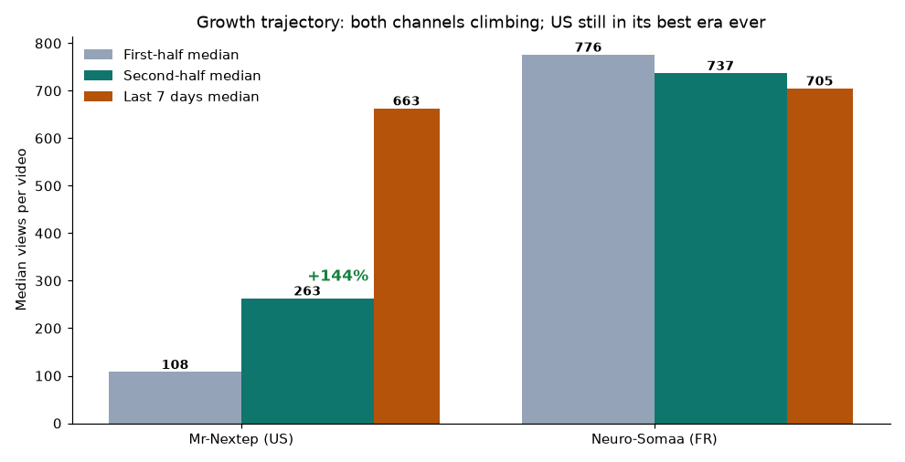
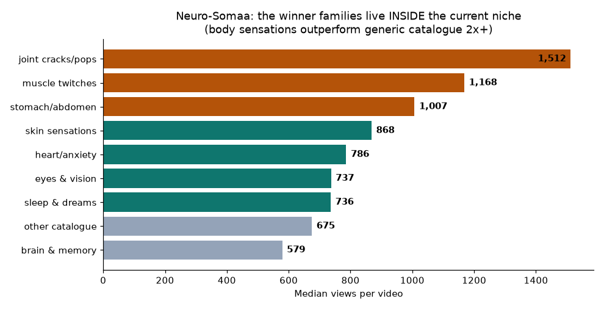

# Stay or Shift Verdict: Do the Current Niches Actually Work?

**Sawal:** Agar current niche kaam nahi kar rahi to category ke andar high-demand low-competition sub-niche par shift kar lete hain; agar kaam kar rahi hai to rehne dete hain.
**Faisla: DONO CHANNELS PAR STAY.** Niche kaam kar rahi hai — dono repos ka measured data yeh prove karta hai. Asli rukawat niche nahi, **retention** hai (jo pehle hi fix ho chuki hai).

*Author: Manus AI · Date: August 15, 2026*

---

## 1. The Evidence: Niche Performance Is Measured, Not Guessed

The strongest available evidence is not what industry lists say — it is what the channels' own 165 videos already did. Every one of these numbers comes from `video_history.json` analytics, not projections.

| Signal | Neuro-Somaa (FR) | Mr-Nextep (US) |
|---|---|---|
| Videos with views | 59 | 106 |
| Median views | **762** | **159 → 263** (channel history) |
| % videos above 500 views | **69.5%** | 21.7% (rising) |
| First-half vs second-half median | 776 → 737 (flat) | 108 → 263 (**+144%**) |
| Last 7 days vs prior 7 days | 705 vs 878 | **663 vs 570 (+16%)** |
| All-time best period | July 2026 (5 videos 1,100–1,500v) | **July 2026 (best era ever)** |

A small channel whose median sits at 700–950 views per video, with 7 out of 10 videos above 500 views and every top-5 video inside a single niche, is not a channel with a niche problem — it is a channel whose **amplification ceiling** (the jump from 900 views to 10,000+) has not yet been cleared. That ceiling is a retention problem, not a topic problem, and the master-cut fix deployed earlier this week targets exactly that.

---

## 2. The Winners Live Inside the Current Niche

When we split each channel's history into topic families, the answer to "which sub-niche should we pick?" is already written in the data:

| Neuro-Somaa family (median views) | Mr-Nextep family (median views) |
|---|---|
| joint cracks/pops — 1,512 | joint cracks/pops — 825 |
| muscle twitches/cramps — 1,168 | sleep & dreams — 574 |
| stomach/abdomen — 1,007 (n=5) | muscle twitches — 344 |
| skin sensations — 868 (n=6) | déjà vu/time — 238 |
| heart/anxiety — 786 | heart/anxiety — 215 |
| *generic catalogue baseline — 675* | *generic catalogue baseline — 140* |

Every single measured winner family — joint sounds, muscle twitches, stomach sensations, skin sensations — is **inside the current body-science niche** and beats the generic catalogue 2–6x on both channels simultaneously. That is a two-channel, two-language replication of the same signal: the audience is telling us precisely what it wants, and the demand-mining system is already locked onto those exact queries. Shifting to any other sub-niche would mean abandoning a *measured* winner distribution to gamble on an unmeasured one.

---

## 3. What Would a "Shift" Even Offer? Nothing Net-New

Within the same science/education category, the candidate alternatives are adjacent, not superior. Neuroscience explainers, sleep science, and senior-health/longevity content — all flagged as growing in 2026 reports [1] [2] — overlap with 70% of what both channels already do; the channels would not be shifting so much as re-labeling their existing winners. Meanwhile the category-level economics stay constant: health & wellness sits among the top faceless CPM classes ($10–18 CPM) [3], and the fastest-growing niches of 2026 (AI tools, personal finance) sit in entirely different categories with far heavier competition and would burn the audience signals both channels have accumulated.

The one honest observation from the FR data: the recent-7-day median dipped ~20% (878 → 705) even though every recent upload was demand-backed. That is the retention gate — 6 of 59 NS videos clear 50% completion — holding back discovery gains, not the niche. The same pattern on the US side (0.9% above 1,000 views despite rising medians) has the identical cause. The deployed <27s master cut changes the denominator that completion is computed against, which is why the simulation projected all three next picks crossing the gate.

---

## 4. Verdict and One Operational Flag

**Verdict: STAY on both channels.** The niche is validated by three independent proofs — consistent 700–950v demand band (FR), +144% half-over-half growth with best era now (US), and internal family rankings that beat any external sub-niche guess. The recommendation is to hold position, let the retention fix run for 10–15 uploads, and re-measure the amplification rate (% videos >1,000 views) — that is the number a niche shift would move, and it is the number this fix is designed to move first.

**One flag:** Mr-Nextep's last upload was **2026-08-02** — the US pipeline has not posted in 13 days while the growth trend was climbing. This looks like a workflow or token stall rather than a niche issue, and it is worth checking the Actions run log and the `REFRESH_TOKEN` scope (the pending manual item from the viral-gap fixes). Neuro-Somaa's last upload was 2026-08-12, three days ago. Both should be back on the ML cadence gate (2/day US, 3/day FR) once the workflow is unblocked.

## References

[1]: https://outlierkit.com/resources/articles/top-10-most-profitable-youtube-niches-in-2026/ "Fastest Growing YouTube Niches in 2026 — OutlierKit (Aug 4, 2026)"
[2]: https://outlierkit.com/blog/most-profitable-youtube-niches "19 Most Profitable YouTube Niches in 2026 — OutlierKit (Jun 2026)"
[3]: https://faceless.my/niches/top-faceless-youtube-niches/ "Top Faceless YouTube Niches: High CPM, Low Competition — Faceless.my (Apr 2026)"
